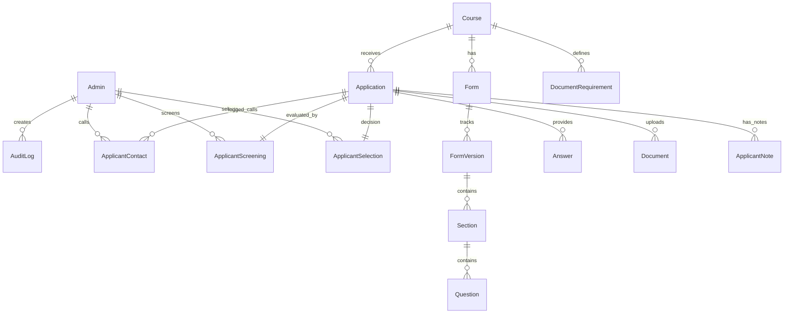
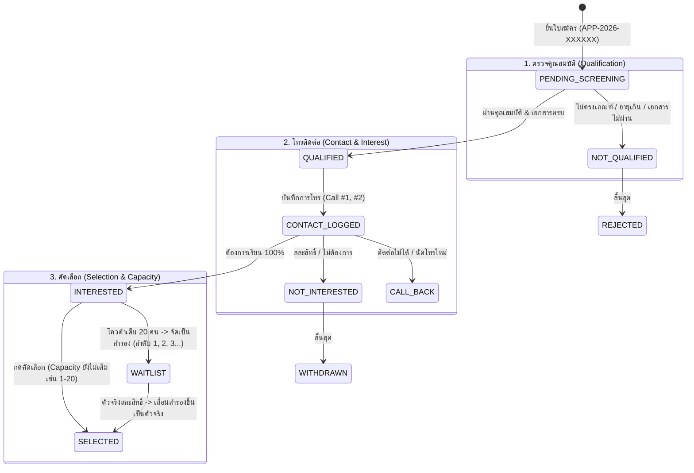

# Training Form Builder & Applicant Screening Management System
## สถาปัตยกรรมระบบและการออกแบบเชิงลึก (System Architecture & Blueprint)

เอกสารนี้รวบรวมพิมพ์เขียว (Blueprint) ครบถ้วนตาม **Section 41. FINAL REQUIREMENT** ของ Master Prompt ก่อนเริ่มขั้นตอนการ Generate Code ทั้งหมด

---

## 1. System Architecture (สถาปัตยกรรมระบบ)

```mermaid
graph TD
    User([ผู้สมัครทั่วไป - Public User]) -->|HTTPS / Browser| Cloudflare[Edge CDN / DNS]
    Admin([เจ้าหน้าที่ / Admin / Reviewer]) -->|HTTPS / Browser (Auth Session)| Cloudflare

    Cloudflare --> NextApp[Next.js 15+ App Router on Vercel]
    
    subgraph NextApp [Next.js Core Application]
        PublicPages["/apply/:courseId (Public Registration)"]
        AdminPages["/admin/* (Dashboard, Screening, Course, Forms)"]
        APIRoutes["/api/* (Protected & Public REST Endpoints)"]
        AuthModule[NextAuth / Jose JWT Engine + RBAC]
        ValidationEngine[Zod Schema Validator + Anti-Duplication]
        ExportEngine[ExcelJS / SheetJS & PDF Report Generator]
    end

    NextApp -->|Prisma Client / Connection Pool| DB[(PostgreSQL Database / Supabase / Neon)]
    NextApp -->|Drive API v3 / Service Account| GDrive[(Google Drive Storage Service)]
    NextApp -->|SMTP / Webhook| NotificationService[LINE Messaging API / Email Service]
```

---

## 2. Database ER Diagram & Data Model

ระบบออกแบบด้วย PostgreSQL + Prisma ORM ครอบคลุม:
- **RBAC**: Admin, Roles, Permissions
- **Course & Forms**: Course, FormTemplate, Form, FormVersion, Section, Question
- **Application Core**: Application, Answer, Document
- **Screening & Selection Workflows (ตาม Master Prompt)**:
  - `ApplicantScreening` (ตรวจคุณสมบัติ: PENDING, QUALIFIED, NOT_QUALIFIED)
  - `ApplicantContact` (ประวัติการโทร: NOT_CONTACTED, CONTACTED, NO_ANSWER, CALL_BACK พร้อมความประสงค์: INTERESTED, NOT_INTERESTED, UNDECIDED)
  - `ApplicantSelection` (ผลคัดเลือก: PENDING, SELECTED, WAITLIST พร้อม waitlistOrder, REJECTED, WITHDRAWN)
  - `ApplicantNote` & `AuditLog`



---

## 3. Folder Structure (โครงสร้างโปรเจกต์)

```text
d:/onedrive/Code/รับสมัคร/
├── prisma/
│   ├── schema.prisma           # ครบถ้วนตามตารางข้างต้น
│   └── seed.ts                 # ข้อมูลเริ่มต้น: SuperAdmin, Course ตัวอย่าง, Form Templates, ผู้สมัคร Mockup 400 คน
├── public/
│   ├── uploads/                # Local fallback สำหรับไฟล์
│   └── templates/
├── src/
│   ├── app/
│   │   ├── (auth)/
│   │   │   └── login/          # หน้า Login เจ้าหน้าที่
│   │   ├── (public)/
│   │   │   ├── page.tsx        # รายการหลักสูตรที่เปิดรับสมัคร
│   │   │   └── apply/[courseId]/ # ฟอร์มรับสมัครสาธารณะ รองรับ Dynamic Fields
│   │   ├── admin/
│   │   │   ├── layout.tsx      # Sidebar, Header, RBAC Guard, User Menu
│   │   │   ├── page.tsx        # Dashboard (สรุปผู้สมัคร 400 คน, กราฟ Funnel, สถิติ)
│   │   │   ├── courses/        # จัดการหลักสูตร (สร้าง, แก้ไข, กำหนดจำนวนรับ, ปิดรับ)
│   │   │   ├── forms/          # Form Builder & Template Management
│   │   │   ├── applicants/     # หน้ารายชื่อตารางผู้สมัคร (Filter, Bulk Action, Export)
│   │   │   ├── screening/      # หน้าคัดเลือกผู้สมัครทีละคน (Quick Screening + Keyboard Shortcuts)
│   │   │   ├── waitlist/       # บริหารคิวสำรองและการเลื่อนสิทธิ์
│   │   │   ├── reports/        # รายงานและ Export Excel/PDF
│   │   │   └── audit-logs/     # บันทึกประวัติการเปลี่ยนแปลง
│   │   └── api/
│   │       ├── auth/
│   │       ├── courses/
│   │       ├── forms/
│   │       ├── apply/
│   │       ├── applicants/
│   │       ├── screening/
│   │       ├── export/
│   │       └── documents/
│   ├── components/
│   │   ├── ui/                 # Buttons, Modals, Badges, Tabs, Forms
│   │   ├── form-builder/       # Drag & drop / List questions builder
│   │   ├── public-form/        # Renderer สำหรับผู้สมัคร
│   │   ├── screening/          # Single Applicant Viewer, Call History, Quick Action Panel
│   │   └── dashboard/          # Funnel Metric Cards & Charts
│   ├── lib/
│   │   ├── prisma.ts           # Prisma client singleton
│   │   ├── auth.ts             # JWT / Session Helpers
│   │   ├── gdrive.ts           # Google Drive Service Account integration
│   │   ├── audit.ts            # Audit logging utility
│   │   └── utils.ts            # ID card mask, Thai Date formatter, Application Number generator
│   └── types/
│       └── index.ts            # Types for Screening, Selection, Statuses
├── .env.example
├── package.json
├── tailwind.config.ts
└── tsconfig.json
```

---

## 4. API Specification & Endpoints

| Method | Endpoint | สิทธิ์ | คำอธิบาย |
|---|---|---|---|
| `POST` | `/api/auth/login` | Public | เข้าระบบ Admin |
| `GET` | `/api/courses` | Public/Admin | ดึงรายการหลักสูตร |
| `POST` | `/api/courses` | Admin | สร้างหลักสูตรใหม่พร้อมเกณฑ์รับ |
| `GET` | `/api/courses/:id/form` | Public | ดึง Schema ฟอร์มล่าสุดสำหรับผู้สมัคร |
| `POST` | `/api/apply/:courseId` | Public | ยื่นใบสมัคร (ตรวจสอบ Unique เลขบัตร ปชช., สร้าง APP-2026-XXXXXX) |
| `GET` | `/api/screening/:courseId` | Admin | ดึงคิวผู้สมัครสำหรับคัดเลือกทีละคน พร้อม Filter สถานะ |
| `POST` | `/api/screening/evaluate` | Admin | บันทึกตรวจคุณสมบัติ (QUALIFIED / NOT_QUALIFIED + เหตุผล) |
| `POST` | `/api/screening/call-log` | Admin | บันทึกประวัติการโทร + ความต้องการเรียน |
| `POST` | `/api/screening/select` | Admin | ตัดสินคัดเลือก (SELECTED / WAITLIST ลำดับถัดไป / REJECTED) |
| `POST` | `/api/waitlist/promote` | Admin | เลื่อนลำดับสำรองขึ้นเป็นตัวจริงเมื่อมีคนสละสิทธิ์ |
| `GET` | `/api/export/:courseId` | Admin | Export Excel / CSV ตามกลุ่มสถานะ |

---

## 5. Workflow State Machine



---

## 6. Security, PDPA & Google Drive Integration
1. **PDPA**:
   - เลขบัตรประชาชน Mask `1-1004-XXXXX-12-3` บนหน้าตารางและแสดงเฉพาะผู้มีสิทธิ์
   - Privacy Notice & Checkbox ยินยอมประมวลผลข้อมูลส่วนบุคคลในหน้าสมัคร
2. **Google Drive Integration**:
   - ใช้ Google Service Account จัดเก็บโฟลเดอร์แยกตาม: `Training Application > {CourseCode} > {ApplicationNumber} > Files`
   - มี Local Fallback เมื่อยังไม่ได้ตั้งค่า Google Credentials
3. **Audit Trail**:
   - บันทึกการกดเปลี่ยนสถานะทุกครั้ง: `Admin ID`, `Old Status`, `New Status`, `Timestamp`, `IP Address`
